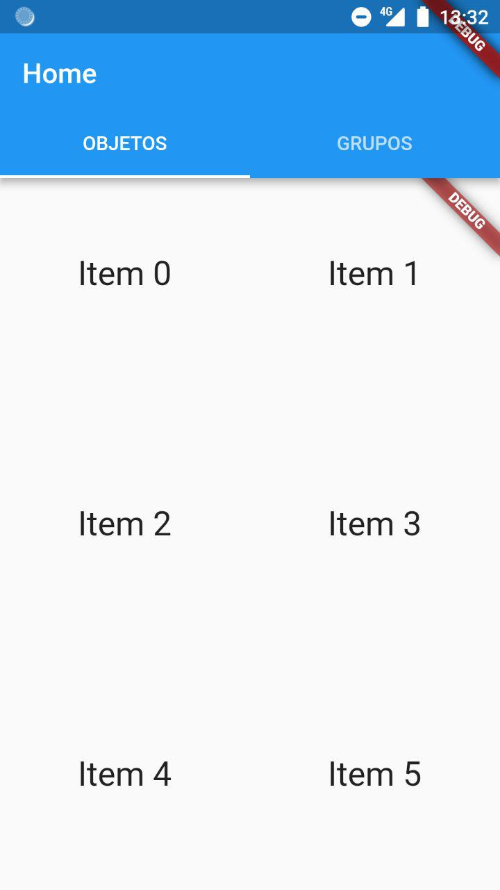

# flutter_app
directorio para la app

## probar la app
```
$ flutter run
```

## limpiar antes de git push
para no subir archivos innecesarios (y que pesan lo suyo), antes de hacer `$ git add .; git commit -m "mensaje del commit"; git push origin master`
```
$ flutter clean
```
este comando elimina el directorio `build/`

## último screenshot


